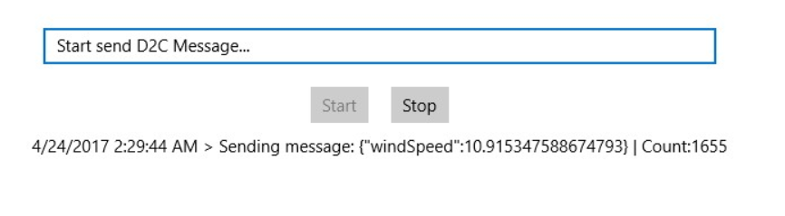

# win10-iot-core-diagnostic-app
This is a demo project using azure-iot-diagnostics-csharp SDK for Windows 10 IoT Core which can be running on the Raspberry 2/3.

## ScreenShot

## A quick guide to deploy this demo to device
1. Open this project using Visual Studio 2017
2. Rebuild
3. Package application (https://docs.microsoft.com/en-us/windows/uwp/packaging/packaging-uwp-apps)
4. Install app on the device (https://developer.microsoft.com/en-us/windows/iot/docs/appinstaller)

## Related project
azure-iot-diagnostics-csharp
 
https://github.com/VSChina/azure-iot-diagnostics-csharp
